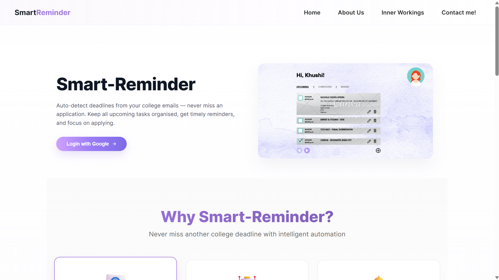
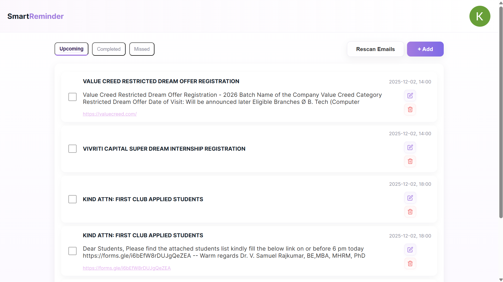
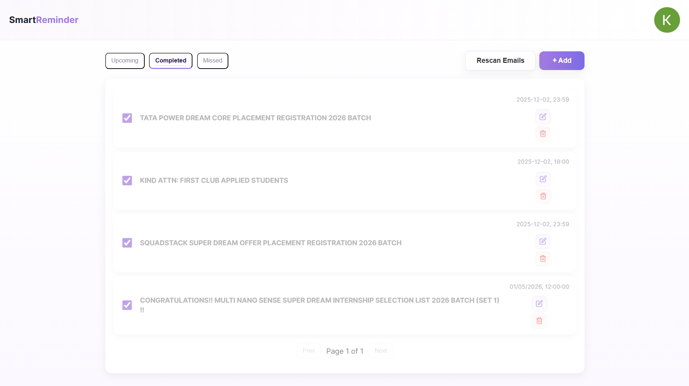

# Smart Reminder App

This is my personal **Smart Reminder App** - a productivity system I built for myself using **Google OAuth, Express, MongoDB, and React.**
It automatically scans my Gmail for **deadlines, organizes reminders, and sends web push notifications** exactly when I need them.

I created this app because I wanted a tool that works the way I work - fast, reliable, and fully integrated with my email.
---

## Overview

**Smart Reminder App** lets you:

- Log in using **Google (Gmail OAuth)**  
- Automatically scan Gmail for deadlines  
- Create, edit, delete, snooze reminders  
- Get **web push notifications**  
- View Upcoming, Completed, and Missed tasks  
- Stay organized with a clean, responsive UI  

It's a **personal assistant** integrated with your Gmail.

---

## Tech Stack

| Layer       | Technology                                 |
|------------|---------------------------------------------|
| Frontend   | React (Vite), Axios, CSS                    |
| Backend    | Node.js + Express                           |
| Database   | MongoDB + Mongoose                          |
| OCR/Parsing| googleapis (Gmail API), chrono-node         |
| Scheduling | node-cron                                   |
| Notifications | Web Push (VAPID)                         |
| Auth       | Google OAuth (session-based, not JWT)       |

---

## Key Features

- Login via **Google OAuth**  
- Gmail scanning for deadlines  
- Reminder creation & management  
- Web push notifications  
- Session-based authentication  
- Responsive dashboard with filtering  
- Service worker for push delivery  

---

## How It Works (Simple)

1. **Login with Google** → consent to Gmail read-only scope  
2. Backend fetches emails + extracts deadlines  
3. Reminders stored securely in MongoDB  
4. Cron scheduler checks reminders periodically  
5. Notifications sent via Web Push  
6. User manages reminders from dashboard  

---

## ⚡ Setup Instructions

### Backend

```bash
cd backend
npm install
```

Create a `.env` file:

```
PORT=3000
MONGO_URI=your_mongo_url
SESSION_SECRET=some-long-random-string

GOOGLE_CLIENT_ID=your_google_client_id
GOOGLE_CLIENT_SECRET=your_google_client_secret
GOOGLE_REDIRECT_URI=http://localhost:3000/api/oauth2callback

VAPID_PUBLIC_KEY=your_vapid_public_key
VAPID_PRIVATE_KEY=your_vapid_private_key
VAPID_SUBJECT=mailto:your_email
```

Run the backend:

```bash
npm run dev
```

---

## Frontend

```bash
cd frontend
npm install
npm run dev
```

Open the project in your browser:  
http://localhost:5173

---

## Concepts 

| Term            | Meaning                                                             |
|-----------------|---------------------------------------------------------------------|
| Google OAuth    | Login + Gmail access via Google identity & tokens                   |
| Gmail API       | Reads messages & extracts deadlines                                 |
| chrono-node     | Natural language date extraction                                    |
| Web Push        | Delivers browser notifications using VAPID keys                     |
| Cron Jobs       | Automated background tasks for reminder scheduling                   |
| REST API        | Backend routes for reminders and Gmail scanning                     |

---

## Preview

  

  



---

## About Me

Hi! I’m **Khushi Kashyap** 👋  
I love **web development, automation, and building useful apps.**
This project showcases my passion for **MERN stack + system automation + user-centered design.**
